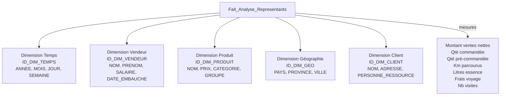

# Modélisation Data Warehouse

**Cas pratique : Datamart d’analyse de l’activité des représentants commerciaux**
*(Entreprise de vente d’imprimantes)*

## 1. Rappel des concepts fondamentaux

### 1.1 Data Warehouse vs Data Mart

- **Data Warehouse (Entrepôt de données)** : Vision **centralisée et universelle** de toutes les informations de l’entreprise.
- **Data Mart** : Sous-ensemble du Data Warehouse, organisé par **fonction** (ventes, RH, commandes…) ou par **sous-ensemble** (un Data Mart par succursale).

### 1.2 Concepts clés

- **Dimension** : Axe d’analyse (ex. : Client, Produit, Géographie, Temps, Vendeur).
- **Fait** : Élément à analyser (ex. : CA net, quantité vendue, km parcourus, consommation d’essence, nombre de visites).
- **ETL** : Processus qui extrait, transforme et charge les données des systèmes opérationnels vers le Data Warehouse.

### 1.3 Deux modèles de schémas

- **Modélisation en Étoile** (Star Schema) : La plus simple et la plus utilisée. Une table de faits au centre reliée directement à des tables de dimensions.
- **Modélisation en Flocon** (Snowflake Schema) : Variante normalisée de l’étoile. Les dimensions contiennent des hiérarchies (ex. : Produit → Catégorie → Sous-catégorie) pour gagner en performance sur de très grosses dimensions.

---

## 2. Étude de cas (l’exemple concret et intéressant)

**Contexte**
On vous demande de concevoir un **Data Mart en modélisation étoile** pour analyser l’activité des représentants commerciaux d’une entreprise de vente d’imprimantes.

**Besoins exprimés par le chef d’entreprise** :

- Les employés font-ils vraiment leur travail ?
- Quelle est la **zone de couverture** réelle des vendeurs ?
- Où sont les endroits où les vendeurs sont **le moins efficaces** ?
- Quelle est la **moyenne de ventes** par représentant ?
- Etc.

**Données disponibles** (issues de 2 systèmes différents) :

- Système de gestion des ressources humaines (RH)
- Système de gestion des ventes + feuilles de route :
  - Kilomètres parcourus
  - Litres d’essence utilisés
  - Frais de voyage
  - Ventes réalisées
  - Promesses de ventes
  - Quantités commandées / pré-commandées
  - Nombre de visites clients

**Objectif du Data Mart** : Permettre des analyses croisées rapides (ex. : ventes par vendeur × zone géographique × temps) tout en gardant une structure simple et compréhensible par les décideurs non-informaticiens.

---

## 3. Analyse des besoins (résultat de la phase d’analyse)

Pendant la phase d’analyse, on a posé aux décideurs les questions classiques :

| Axe d’analyse               | Niveaux de détail possibles            | Mesures / Faits à analyser                         |
| ---------------------------- | --------------------------------------- | --------------------------------------------------- |
| **Date / Temps**       | Année, Mois, Jour, Heure               | — (dimension obligatoire dans tout Data Warehouse) |
| **Vendeur**            | Nom, Prénom, Salaire, Date d’embauche | —                                                  |
| **Produit**            | Catégorie, Type, Groupe                | Prix, quantité vendue, quantité pré-commandée   |
| **Zone géographique** | Pays, Province, Ville                   | —                                                  |
| **Client**             | Nom, Adresse, Personne ressource        | —                                                  |

**Mesures (faits) identifiées** :

- Montant des ventes nettes
- Quantité commandée
- Quantité pré-commandée
- Kilomètres parcourus
- Consommation d’essence (litres)
- Frais de voyage
- Nombre de visites
- Promesses de ventes

---

## 4. Modélisation en ÉTOILE (recommandée pour ce cas)

### 4.1 Structure générale

- **Table de faits** : `Fait_Analyse_Representants` (contient toutes les **mesures** numériques)
- **Tables de dimensions** : 5 dimensions reliées directement à la table de faits (relation 1:N)

### 4.2 Schéma en étoile (représentation textuelle)

